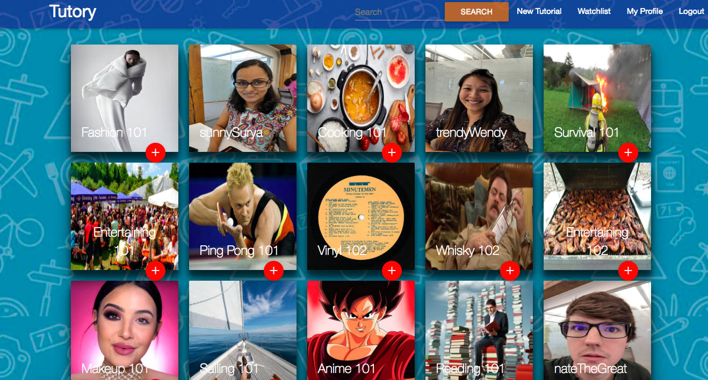

# TUTORY
------------------------------

### ABOUT THIS PROJECT
This full-stack project was completed by a 3-dev team with the goal of creating a fully functional web-app for users to interact with. It was born out of the idea to provide everyday people with the opportunity to become teachers in the fields that they excel in. Users can quickly and easily create custom tutorials without having to register for any more than a basic user profile. Users are not required to login to view the tutorials, but once logged in, a user can add their favorite tutorials to a watchlist to watch anytime. 

Tutory was built from the ground up, including a PostgreSql database, a Node & Express server, and a Javascript frontend. User authentication is included using JWT, as well as styling using Materialize and Bootstrap. 

### OPTIONS AVAILABLE TO THE USER

    -View & search tutorials & users without register or logging in
    -Register { First Name, Last Name, Username, Email, Password, Password-Duplicate }
    -Login { Username, Password }
    -Create Tutorial { Title, description, image, videos (up to 5) }
    -Add tutorial to watchlist
    -Watch Tutorial
    - Logout  

### FEATURES

-Token Authorization ensures that only one user has access to their unique profile and watchlist

-Users are able to create tutorials in a matter of minutes

-Users can search for users or tutorials

-Users can add tutorials to their watchlist, and access the tutorials in this watchlist at any time

-Users can add comments to tutorials

### TO INSTALL TUTORY

    -fork and clone this frontend repository onto your local machine
    -run 'npm install' in your terminal
    -run 'npm run dev'
    -the previous step will open the frontend program in your browser using live-server, connected to the backend deployed with Heroku

### TO USE TUTORY ONLINE

<a href="">Tutory Online!</a>

### BUILT WITH

    -Javascript, HTML & CSS
    -Materialize & Bootstrap
    -Axios
    -Browserify & Watchify
    -Live-server 
    -Moment
    -Lodash
    -Node
    -Express
    -PostgreSQL

### DEVELOPERS

    -For more information, pleasee contact this project's developers, Branden Lowe, Nate Semmler or Jewell White at:   

    b.lowe333@gmail.com, ndsunc@gmail.com or jewellsmailbox@gmail.com 

